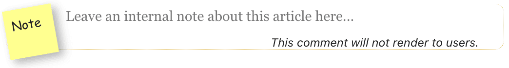
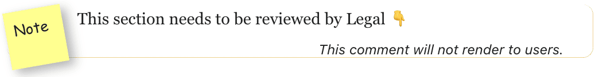
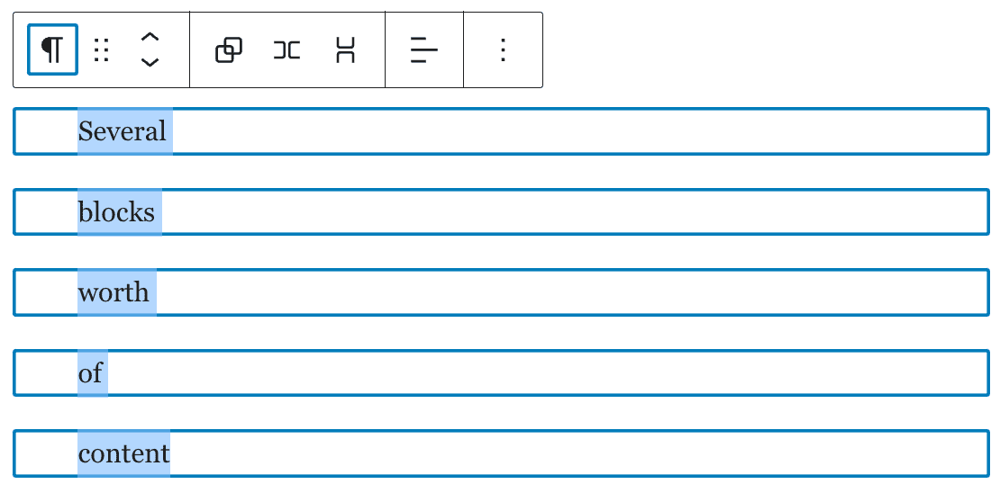
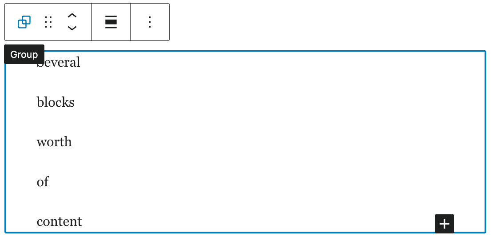
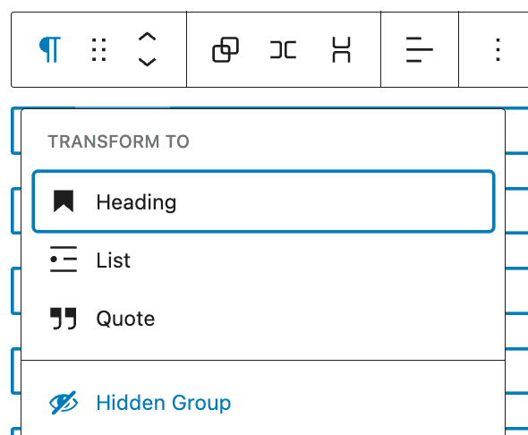
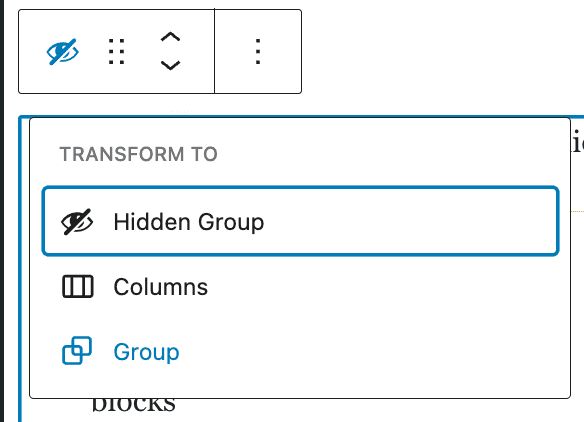
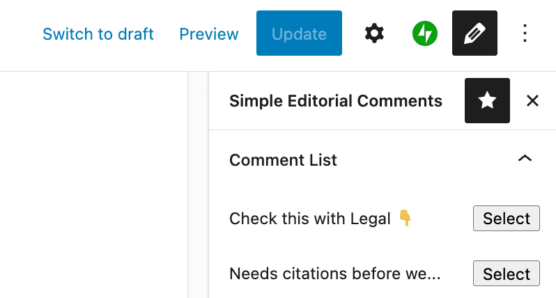

# Simple Editorial Comments

## User Guide

This simple plugin provides blocks for editorial comments and discussion. It is simplistic by design, and not intended as an in-depth conversation or approval mechanism.

### Editorial Comment block

The main block provided by this plugin is an Editorial Comment block, which permits authors and editors to leave notes in a post or page that will not render on the site frontend. They can be used to flag issues, leave thoughts for follow-ups, or for whatever purpose serves your team.

To insert an Editorial Comment block, either use the block inserter in the upper-left, or type `/editorial comment` to select and insert the block.

> 

Once inserted, it will look like this:

> 

You may click on and edit the block text to leave detailed feedback:

> 

### Hidden Group block

This plugin also provides a Hidden Group block. This block is intended to permit editors to flag whole sections of content for review, and to prevent them from being viewed publicly until any issues are addressed.

A Hidden Group block can be inserted in the same fashion as the Editorial Comment block, but it is more common to want to hide an existing group or collection of blocks.

To create a hidden group, select one or more blocks:

> 

or, select an existing group block:

> 

then, click on the block type icon in the upper-left of the toolbar, and select "Hidden Group" to wrap these blocks in a hidden group:

> 

To revert a Hidden Group to a regular group, follow these same steps in reverse:

> 

## Comment List sidebar

A list of all comments in the current post can be expanded in the sidebar by clicking the "pencil" icon in the upper-right. (If this pencil icon does not appear, click the three-dot options menu and ensure that the Simple Editorial Comments menu is activated in the "Plugins" section.)

> 

Click "Select" next to any of the comment previews to jump to that comment in the editor.

## Development

If you are using [nvm](https://github.com/nvm-sh/nvm) to manage Node versions, run `nvm use` to auto-select the appropriate version of Node for this project.

Install dependencies with `npm install`.

Available commands once installed:

- `npm run build`: Generate production-ready asset bundles.
- `npm start`: Run the hot-reloading development server.
- `npm run lint`: Check the code for errors.

## Release Process

### Versioning

This plugin follows [Semantic Versioning](https://semver.org/).

In a nutshell, this means that **patch releases**, for example, 1.2.3, only contain **backwards compatible bug fixes**.
**Minor releases**, for example, 1.2.0, may contain **enhancements, new features, tests**, and pretty much everything that **does not break backwards compatibility**.
Every **breaking change** to public APIs—be it renaming or even deleting structures intended for reuse, or making backwards-incompatible changes to certain functionality—warrants a **major release**, for example, 2.0.0.

If you are using Composer to pull this plugin into your website build, choose your version constraint accordingly.

Even when bumping a major version, if the blocks provided by this plugin change in a backwards-incompatible way, a [block deprecation](https://developer.wordpress.org/block-editor/reference-guides/block-api/block-deprecation/) should be added to let users migrate their visualizations to the new version of the block.

### Publishing a Release

Release management is done using GitHub's built-in Releases functionality. When you tag a commit on the `main` branch with a version number in the format `v#.#.#`, a release action will trigger when that tag is pushed to GitHub.
The GitHub actions release workflow creates a new built release based on the contents of the tag you created.
It copies the tag's current state to a new tag of `original/v.*.*.*`, then builds the project and pushes the built version to the original tag name `v*.*.*`.
This allows composer to pull in a built version of the project without the need to run webpack to use it.

To prepare a release, follow these steps:

1. Ensure you are on the `main` branch and that there are no uncommitted local changes.
2. Bump the version number in `package.json` and `plugin.php` depending on whether you are preparing a major, minor, or patch release (see [Versioning](#versioning) above).
3. List any relevant updates, enhancements, or breaking changes in the Changelog section below.
4. Commit this version number change and associated changelog updates, optionally specifying release notes in the commit message.
5. Create a tag with the same number as the updated project version number, e.g. `v1.2.3`.
6. Push the updated `main` branch and tag to GitHub.

Once a release has been created, update the release's description using GitHub's interface to add patch notes. Release notes should be high-level but complete, detailing all _New Features_, _Enhancements_, _Bug Fixes_ and potential other changes included in the according version.

### Development testing

Any code merged into the `develop` branch will be build and committed to the `release-develop` branch. This branch can be used in non-production applications to validate and test proposed changes.

## Changelog

**v0.1.0**

- Initial release
- Introduce "Editorial Comment" block
- Introduce "Hidden Group" block
